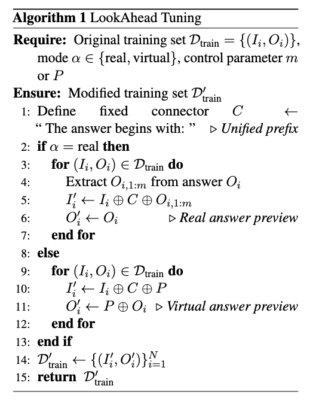

<h1 align="center"> LookAhead Tuning </h1>
<h3 align="center"> Safer Language Models via Partial Answer Previews </h3>

<p align="center">
  <a href="google.com">📄arXiv</a>
</p>


<div>
</div>
<div align="center">
<p align="center">
  
</p>
</div>

[](https://github.com/zjunlp/LookAheadTuning) [](https://opensource.org/licenses/MIT)  

## Table of Contents

- 🌻 [Acknowledgement](#acknowledgement)
- 🌟 [Overview](#overview)
- 🔧 [Algorithm](#algorithm)
- 🚀 [Installation](#installation)
- 📚 [Partial Answer Preview](#partial-answer-preview)
- 📉 [Vanilla Fine-Tuning](#vanilla-fine-tuning)
- 🧐 [OURS](#ours)
- 🚩 [Citation](#citation)

## 🌻Acknowledgement

Our dataset is sourced from the [GSM8K dataset](https://huggingface.co/datasets/openai/gsm8k), the [Samsum dataset](https://huggingface.co/datasets/Samsung/samsum), and the [HEx-PHI dataset](https://huggingface.co/datasets/LLM-Tuning-Safety/HEx-PHI) . Our training code and safety evaluation procedures are derived from the [LLMs-Finetuning-Safety](https://github.com/LLM-Tuning-Safety/LLMs-Finetuning-Safety) and the [shallow-vs-deep-alignment](https://github.com/Unispac/shallow-vs-deep-alignment).

**We sincerely appreciate their remarkable contributions to the field.**

## 🌟Overview

LookAhead Tuning comprises two data-centric, resource-efficient, simple, and effective methods. The fundamental concept is modifying the training data to preview the answer prefix tokens, thereby reducing the loss associated with these tokens and minimizing disturbances to the model’s initial tokens, which helps maintain the model’s safety. 

## 🔧Algorithm

<div>
</div>
<div align="center">
<p align="center">
  
</p>
</div>

## 🚀Installation

1. Clone the Repository and Enter the Directory:

   ```bash
   git clone https://github.com/zjunlp/LookAheadTuning
   cd LookAheadTuning
   ```

2. Install Dependencies:

   ```bash
   pip install -r requirements.txt
   ```

3. Download the Model:

   Download the [LLaMA 2 7B Chat model](https://huggingface.co/meta-llama/Llama-2-7b-chat-hf) into the `LookAheadTuning/llama-2-7b-chat-hf` directory. Alternatively, you can use another model and tokenizer.


## 📚Partial Answer Preview

We utilize a Python script named `main.py` that is designed to process datasets in both JSON and JSONL formats using two distinct modes: **real** and **virtual**. This tool allows you to modify your training data, enabling a preview of the answer by adjusting specific fields based on your selected mode. **Inference data is unchanged.**

#### Features

- **Supports Multiple Formats**: Handles both JSON and JSONL (JSON Lines) file formats.
- **Dual Processing Modes**:
  - **Real Mode**: Uses a tokenizer to concatenate a specified number of tokens from the output field to the input field.
  - **Virtual Mode**: Inserts a predefined string into both the input and output fields without tokenization.
- **Customizable Fields**: Specify which fields in your JSON objects to process.
- **Easy Configuration**: Simple command-line arguments to tailor the processing to your needs.

#### Usage

Run the `main.py` script from the command line with the appropriate arguments.

#### Arguments

- `--input_file`: (Required) Path to the input file.
- `--output_file`: (Required) Path to the output file.
- `--input_format`: (Required) Format of the input file. Choose either `json` or `jsonl`.
- `--output_format`: (Required) Format of the output file. Choose either `json` or `jsonl`.
- `--input_field`: (Optional) Field name for the input in the JSON objects. Default is `input`.
- `--output_field`: (Optional) Field name for the output in the JSON objects. Default is `output`.
- `--mode`: (Required) Processing mode. Choose either `real` or `virtual`.
  - **Real Mode**:
    - `--m`: Number of tokens to preview.
    - `--tokenizer_path`: Path to the model tokenizer.
  - **Virtual Mode**:
    - `--P`: Predefined string to insert.

For more detailed parameters, refer to the `main.py` file.

#### Examples

**Real Mode**: Set `m=6` and use `question` as the input field and `answer` as the output field.

```bash
python main.py \
    --input_file data/gsm8k/train.json \
    --output_file data/gsm8k/train_real_6.json \
    --input_format jsonl \
    --output_format jsonl \
    --input_field question \
    --output_field answer \
    --mode real \
    --m 6 \
    --tokenizer_path llama-2-7b-chat-hf 
```

**Virtual Mode**: Set `P=" Let's solve this problem. "` and use `question` as the input field and `answer` as the output field.

```bash
python main.py \
    --input_file data/gsm8k/train.json \
    --output_file data/gsm8k/train_virtual.json \
    --input_format jsonl \
    --output_format jsonl \
    --input_field question \
    --output_field answer \
    --mode virtual \
    --P " Let's solve this problem. " 
```

#### Notes

- The file extension of `input_file` does not need to match the `--input_format` argument. Ensure that the content of the input file corresponds to the specified `--input_format` (`json` or `jsonl`).
- The `input_field` and `output_field` should correspond to the fields in your JSON objects.
- In **real** mode, both `--m` and `--tokenizer_path` are required.
- In **virtual** mode, `--P` is required.

## 📉Vanilla Fine-Tuning

#### Initialization

First, clone the repository and organize the required files:

```
git clone https://github.com/Unispac/shallow-vs-deep-alignment
mv data shallow-vs-deep-alignment/finetuning_buckets/datasets
mv Vanilla_FT.sh eval shallow-vs-deep-alignment
cd shallow-vs-deep-alignment
```

Next, set up the Python environment required to run `shallow-vs-deep-alignment`, and ensure you have access to 4 A100/H100 80GB GPUs for execution.

#### Training and Inference

To perform vanilla fine-tuning, run the following command:

```
bash Vanilla_FT.sh
```

#### Evaluation

Please note that the `input_file` parameters used here should point to the paths generated as `save_path` from steps 2, 3, and 4 in `Vanilla_FT.sh` during the training and inference process.

Utility Assessment: Calculate the utility using the specified metrics:

```
python eval/calculate_utility.py rouge1 --input_file <path>
python eval/calculate_utility.py gsm8k --input_file <path>
```

Safe Rate Assessment: Provide scores using both keywords and GPT-based methods.

Using keywords:

```
python eval/calculate_safe_rate.py --input_file <path> --mode keywords
```

Using GPT (where `path_2` is where each data score is stored):

```
python eval/calculate_safe_rate.py --input_file <path_1> --mode gpt --output_file <path_2> --api_key <your_key>
```

## 🧐OURS

To apply our method, follow these steps:

1. Modify the paths in `get_finetuning_data.py` located in `shallow-vs-deep-alignment-main/finetuning_buckets/datasets/utils/`:
   - Update the `load_dataset` calls in the `get_gsm8k` and `get_samsum` functions to point to paths with your modified data (as specified in your data storage path updates in the Partial Answer Preview section).
2. Update all `output_dir` and `save_path` occurrences in `Vanilla_FT.sh` to reflect your desired storage locations.
3. Then, repeat the Training and Inference and Evaluation steps outlined in the Vanilla Fine-Tuning section.


## 🚩Citation

Please cite our repository if you use LookAhead Tuning in your work. Thanks!

```bibtex

```

## 🎉Contributors

We will offer long-term maintenance to fix bugs and solve issues. So if you have any problems, please put issues to us.
